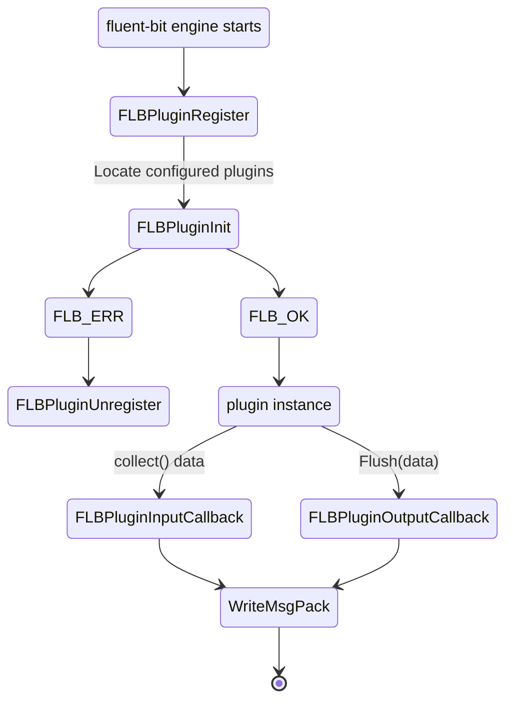

[](https://pkg.go.dev/github.com/calyptia/plugin)
[](https://codecov.io/gh/calyptia/plugin)

# Fluent-bit plugin

This repository contains the required Golang interfaces and data types
required to create [Fluent bit](https://fluentbit.io) Golang plugins.

Plugins can be written for output and input processing.

## Writing an Input plugin

The following are the minimum steps for writing an input plugin. Declaring an Input plugin requires to implement the [Input Plugin interface](https://github.com/calyptia/plugin/blob/main/plugin.go#L45) and defining the 2 methods *Init* and *Collect*

Also, a plugin can share their metrics and use the fluent-bit logger [logger interface](https://github.com/calyptia/plugin/blob/main/plugin.go#L62) over the fluent-bit proxy interface. Check the [metric interface](./metric/metric.go) to implement the plugin's metrics 


```go
package main

import (
	"context"
	"errors"
	"time"

	"github.com/calyptia/plugin"
	"github.com/calyptia/plugin/metric"
)

func init() {
	plugin.RegisterInput("gdummy", "dummy GO!", &gdummyPlugin{})
}

type gdummyPlugin struct {
	counterSuccess metric.Counter
	counterFailure metric.Counter
	log            plugin.Logger
}

// Plugins can initialise metrics (see github.com/calyptia/cmetrics) that will be
// exposed in the metrics endpoints.
func (plug *gdummyPlugin) Init(ctx context.Context, fbit *plugin.Fluentbit) error {
	plug.counterSuccess = fbit.Metrics.NewCounter("operation_succeeded_total", "Total number of succeeded operations", "gdummy")
	plug.counterFailure = fbit.Metrics.NewCounter("operation_failed_total", "Total number of failed operations", "gdummy")

	// fbit.Logger references the default fluent-bit logger.
	plug.log = fbit.Logger
	return nil
}

func (plug gdummyPlugin) Collect(ctx context.Context, ch chan<- plugin.Message) error {
	tick := time.NewTicker(time.Second)

	for {
		select {
		case <-ctx.Done():
			err := ctx.Err()
			if err != nil && !errors.Is(err, context.Canceled) {
				plug.counterFailure.Add(1)
				plug.log.Error("[gdummy] operation failed")

				return err
			}

			return nil
		case <-tick.C:
			plug.counterSuccess.Add(1)
			plug.log.Debug("[gdummy] operation succeeded")

			// This flushes the produced message into the fluent-bit engine.
			ch <- plugin.Message{
				Time: time.Now(),
				Record: map[string]string{
					"message": "dummy",
				},
			}
		}
	}
}

func main() {
}
```

### Building a plugin

A plugin can be built locally using go build as:

```bash
go build -trimpath -buildmode c-shared -o ./go-test-input-plugin.so .
```

Or compiled to linux/amd64 target from darwin/arm64 using [zig](https://ziglang.org/learn/overview/#zig-is-also-a-c-compiler)

```bash
CGO_ENABLED=1 \
GOOS=linux \
GOARCH=amd64 \
CC="zig cc -target x86_64-linux-gnu -isystem /usr/include -L/usr/lib/x86_64-linux-gnu" \
CXX="zig c++ -target x86_64-linux-gnu -isystem /usr/include -L/usr/lib/x86_64-linux-gnu" \
go build -buildmode=c-shared -trimpath -o ./my-plugin-linux-amd64.so ./...
```
Or using a Dockerfile as follows:

```dockerfile
FROM golang:latest AS builder

WORKDIR /fluent-bit
COPY go.mod .
COPY go.sum .
RUN go mod download
RUN go mod verify
COPY . .
RUN go build -trimpath -buildmode c-shared -o ./bin/go-test-input-plugin.so .

FROM ghcr.io/fluent/fluent-bit/unstable:latest-debug
COPY --from=builder /fluent-bit/bin/go-test-input-plugin.so /fluent-bit/etc/

ENTRYPOINT [ "/fluent-bit/bin/fluent-bit" ]
CMD [ "/fluent-bit/bin/fluent-bit", "-c", "/fluent-bit/etc/fluent-bit.conf" ]
```

You need to create a local fluent-bit.conf as follows:

```ini
[SERVICE]
    flush           1
    log_level       debug
    plugins_file    /fluent-bit/etc/plugins.conf

[INPUT]
    Name go-test-input-plugin
    Tag  test-input
```

Also, a plugins.conf definition has to be provided:

```ini
[PLUGINS]
    Path /fluent-bit/lib/go-test-input-plugin.so
```

Run the plugin in a docker container as follows, if you are using
a locally built plugin

```shell
docker run -v $(pwd)/go-test-input-plugin.so:/fluent-bit/lib/go-test-input-plugin.so -v $(pwd)/examples/fluent-bit.conf:/fluent-bit/etc/fluent-bit.conf:ro -v $(pwd)/examples/plugins.conf:/fluent-bit/etc/plugins.conf:ro ghcr.io/fluent/fluent-bit/master:latest
```

If using the docker build, run it as follows:

```shell
docker build -t go-test-input-plugin:main .
docker run -v $(pwd)/examples/fluent-bit.conf:/fluent-bit/etc/fluent-bit.conf:ro -v $(pwd)/examples/plugins.conf:/fluent-bit/etc/plugins.conf:ro  go-test-input-plugin:main
```

For further examples, please check the [examples](./examples) or [testdata](./testdata) folders.

## Running tests

Running the local tests must be doable with:

```shell
go test -v ./...
```

## Architectural overview

Plugins are implemented via proxy callbacks, fluent-bit implements a generic proxy
approach that can be used to load and invoke DSO object callbacks.

The following is the state machine of callbacks.




## Contributing

Please feel free to open PR(s) on this repository and to report any bugs of feature requests
on the GitHub issues page.
