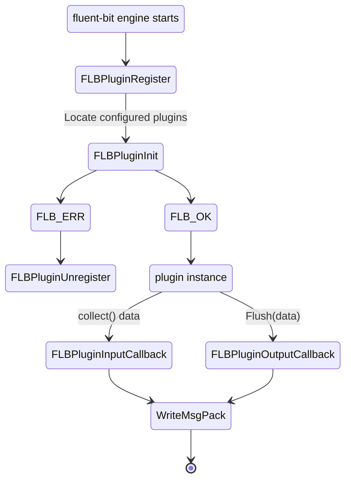

# Fluent-bit plugin

This repository contains the required Golang interfaces and data types
required to create [Fluent bit](https://fluentbit.io) Golang plugins.

## Architectural overview

Plugins are implemented via proxy callbacks, fluent-bit implements a generic proxy
approach that can be used to load and invoke DSO object callbacks.

The following is the state machine of callbacks.



## Writing a plugin

Plugins can be written for output and input processing.

As an example, the following are the minimum steps for writing an input plugin.
Declaring a plugin requires to implement the [InputPlugin interface](./plugin.go).
Explicitly defining the 2 methods *Init* and *Collect*:

```go
package main

import (
 "context"
 "errors"
 "time"

 "github.com/calyptia/plugin"
 cmetrics "github.com/calyptia/cmetrics-go"
)

// Plugin needs to be registered as an input type plugin in the initialisation phase
func init() {
 plugin.RegisterInput("go-test-input-plugin", "Golang input plugin for testing", &dummyPlugin{})
}

type dummyPlugin struct {
 foo string
}

// Init An instance of the configuration loader will be passed to the Init method so all the required
// configuration entries can be retrieved within the plugin context.
func (plug *dummyPlugin) Init(ctx context.Context, conf plugin.ConfigLoader, metrics plugin.Metrics) error {
 plug.foo = conf.String("foo")
 return nil
}

// Collect this method will be invoked by the fluent-bit engine after the initialisation is successful
// this method can lock as each plugin its implemented in its own thread. Be aware that the main context
// can be cancelled at any given time, so handle the context properly within this method.
// The *ch* channel parameter, is a channel handled by the runtime that will receive messages from the plugin
// collection, make sure to validate channel closure and to follow the `plugin.Message` struct for messages
// generated by plugins.
func (plug dummyPlugin) Collect(ctx context.Context, ch chan<- plugin.Message) error {
 tick := time.NewTicker(time.Second)

 for {
  select {
  case <-ctx.Done():
   err := ctx.Err()
   if err != nil && !errors.Is(err, context.Canceled) {
    return err
   }

   return nil
  case <-tick.C:
   ch <- plugin.Message{
    Time: time.Now(),
    Record: map[string]string{
     "message": "hello from go-test-input-plugin",
     "foo":     plug.foo,
    },
   }
  }
 }
}

func main() {}
```

## Adding metrics

Plugin can share their metrics over fluent-bit proxy interface.
As an example, the following are the minimum steps for sharing plugin's metrics,
Using a [metric interface](./metric/metric.go) to implement the plugin's metrics.

```go
package main

import (
 "context"
 "errors"
 "time"

 "github.com/calyptia/plugin"
 "github.com/calyptia/plugin/metric"
)

type dummyPlugin struct {
 counterExample metric.Counter
}

func (plug *dummyPlugin) Init(ctx context.Context, conf plugin.ConfigLoader, metrics plugin.Metrics) error {
 plug.counterExample = metrics.NewCounter("example_metric_total", "Total number of example metrics", "go-test-input-plugin")
 return nil
}


func (plug dummyPlugin) Collect(ctx context.Context, ch chan<- plugin.Message) error {
 tick := time.NewTicker(time.Second)

 for {
  select {
   case <-ctx.Done():
    err := ctx.Err()
    if err != nil && !errors.Is(err, context.Canceled) {
     return err
    }

    return nil
   case <-tick.C:
    plug.collectExample.Add(1)

    ch <- plugin.Message{
     Time: time.Now(),
     Record: map[string]string{
      "message": "hello from go-test-input-plugin",
      "foo":     plug.foo,
     },
    }
  }
 }
}

func main() {}
```

### Building a plugin

A plugin can be built locally using go build as:

```bash
go build -trimpath -buildmode c-shared -o ./bin/go-test-input-plugin.so .
```

Or compiled to linux/amd64 from another machine using [zig](https://ziglang.org/learn/overview/#zig-is-also-a-c-compiler)
*(Example working on darwin/arm64)*.

```bash
CGO_ENABLED=1 \
GOOS=linux \
GOARCH=amd64 \
CC="zig cc -target x86_64-linux-gnu -isystem /usr/include -L/usr/lib/x86_64-linux-gnu" \
CXX="zig c++ -target x86_64-linux-gnu -isystem /usr/include -L/usr/lib/x86_64-linux-gnu" \
go build -buildmode=c-shared -trimpath -o ./my-plugin-linux-amd64.so ./...
```

Or using a Dockerfile as follows:

```dockerfile
FROM golang:latest AS builder

WORKDIR /fluent-bit

COPY go.mod .
COPY go.sum .

RUN go mod download
RUN go mod verify

COPY . .

RUN go build -trimpath -buildmode c-shared -o ./bin/go-test-input-plugin.so .

FROM ghcr.io/calyptia/enterprise/advanced:main

COPY --from=builder /fluent-bit/bin/go-test-input-plugin.so /fluent-bit/etc/

ENTRYPOINT [ "/fluent-bit/bin/fluent-bit" ]
CMD [ "/fluent-bit/bin/fluent-bit", "-c", "/fluent-bit/etc/fluent-bit.conf" ]
```

Then create a fluent-bit.conf as follows:

```ini
[SERVICE]
    flush           1
    log_level       info
    plugins_file    /fluent-bit/etc/plugins.conf

[INPUT]
    Name go-test-input-plugin
    Tag  test-input
    foo  bar
```

Also a plugins.conf definition has to be provided, as follows:

```ini
[PLUGINS]
    Path /fluent-bit/etc/go-test-input-plugin.so
```

Run the docker container as follows:

```shell
docker build -t my-fluent-bit-plugin:main .
docker run --platform=linux/amd64 -v $(pwd)/fluent-bit.conf:/fluent-bit/etc/fluent-bit.conf:ro -v $(pwd)/plugins.conf:/fluent-bit/etc/plugins.conf:ro my-fluent-bit-plugin:main
```

For further examples, please check the [examples](./examples) or [testdata](./testdata) folders.

## Running tests

Running the local tests must be doable with:

```shell
go test -v ./...
```

## Contributing

Please feel free to open PR(s) on this repository and to report any bugs of feature requests
on the GitHub issues page.
